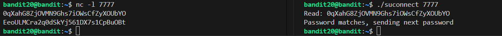
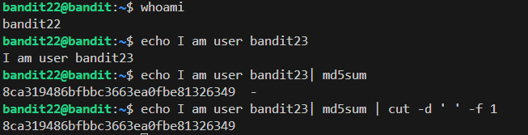

## Level 0 -> 1  
The first level is a simple ssh login with the given username and password  
if we list all files in the home directory we get a README file that contains the password we need: ZjLjTmM6FvvyRnrb2rfNWOZOTa6ip5If  
 

## Level 1 -> 2  
the password for this level is located at ***-*** file inside the home directory. We just type the password path to ***cat***  
***cat ./-***  
the password: **263JGJPfgU6LtdEvgfWU1XP5yac29mFx**

## Level 2 -> 3  
For this level the password is stored at a file called **_spaces in this filename_**. For this if we just use tab completion it makes our jobs easier or we can just put in **_\ _** before the spaces.  
**_cat spaces\ in\ this\ filename_**  
password: **MNk8KNH3Usiio41PRUEoDFPqfxLPlSmx**

## Level 3 -> 4  
The home folder contains a directory and inside the directory the actual file is hidden. the 'ls' command allows us to list all hidden files. Simply include the ***-a*** modifier alongside the command and then type the full name of the file into 'cat'  
***ls -a***  
***cat ...Hiding-From-You***  
Password: **2WmrDFRmJIq3IPxneAaMGhap0pFhF3NJ**

## Level 4 -> 5  
A simple way of doing it is to manually open all the files inside the given folder. Only one of them is in human-readable format and is thus the password(file07).  
A faster way is to check the file type. For this we run the file command across the directory. This shows that only the ***-file07*** is in ASCII format.  
  
Password: **4oQYVPkxZOOEOO5pTW81FB8j8lxXGUQw**

## Level 5 -> 6  
We use the ***find*** command to search for the desired file. We use ***-size*** to find the desired size ***1033c*** (c for bytes) and then pipe the output into the cat. For this challenge the file size is enough to get the desired result.  
***find ./inhere -size 1033c -exec cat {} \;***  
  
Password: **HWasnPhtq9AVKe0dmk45nxy20cvUa6EG**

## Level 6 -> 7
For this the file is loacted somewhere in the server so we set the starting location as ***/*** and follow through with the rest of the command:
***find -size 33c -user bandit7 -type f -group bandit6***  
This command however also prints the output files to the cmd, so we just redirect the output files to ***/dev/null***, somewhere we can just treat as the void. The updated command looks like:  
***find -size 33c -user bandit7 -type f -group bandit6 -readable 2> /dev/null -exec cat {} \;***  
Password: **morbNTDkSW6jIlUc0ymOdMaLnOlFVAaj**

## Level 7 -> 8
This level is about searching inside the file itself. For this we use ***grep***. We read the main file via ***cat*** and then just ***pipe*** the output to ***grep***. Piping refers to chain the output of one command onto the other, for this we use the **|** operator.
***cat data.txt | grep millionth***  
Password: ***dfwvzFQi4mU0wfNbFOe9RoWskMLg7eEc***

## Level 8 -> 9  
To find the uniq lines in a document we just use the ***uniq*** command. There is however one problem with this approach, this command only works on sorted text. To rectify this we run the ***sort*** command and then chain them together.  
***sort data.txt | uniq -u***  
Password: **4CKMh1JI91bUIZZPXDqGanal4xvAg0JM**

leven 9 -> 10  
In here we use ***strings*** to print the human readable strings inside the file and then just pipe it to ***grep***. We use the ***-E*** flag to have it search for the strings which start with ***==***  
***strings data.txt | grep -E '=='***  
Password: **FGUW5ilLVJrxX9kMYMmlN4MgbpfMiqey**  

## Level 10 -> 11  
We use a cmd utility called ***base64***. We provide it with the filename and the flag ***-d*** to decode.
***base64 -d data.txt***  
  
Password: **dtR173fZKb0RRsDFSGsg2RWnpNVj3qRr**

## Level 11 -> 12  
This is an example of a simple substitution cipher called ROT13. In here we use ***tr*** to tranlate the character back using the revered mapping ***n-z,a-m -> a-z***  
Similar to before we pipe the output from cat into it.  
***cat data.txt | tr [n-za-mN-ZA-M] [a-zA-Z]***
Password: **7x16WNeHIi5YkIhWsfFIqoognUTyj9Q4**

## Level 12 -> 13  
We create a temp directory using ***mktemp -d***. As we analyse the files we see that it's the hexdump of a file. We use ***xxd*** to reverse it. On saving it and examining the output we discover that it's a gzip compressed file.  
  
We rename the extension to ***.gz*** and decompress it via ***gzip***. The output we get is a bzip2 compressed file. We decompress it again using bzip. The result is a gzip compressed file. We follow with another round of decompression and we get a ***POSIX tar archive (GNU)***. We change the extension to ***.tar*** and then extract it using ***-xf*** and get a ***.bin*** file.  
  
The new output is also a ***.tar*** file. We go through the same process again and get a ***bzip2 compressed file***. This results is a tar archived file, the uncompression of which leads to a gzip compressed file. Uncompressing this gives us the password.  
Password: **FO5dwFsc0cbaIiH0h8J2eUks2vdTDwAn**

## Level 13 -> 14  
We have a ssh private key inside the home folder. ***ssh*** has a flag to use private key inplace of password. We use that to log in as ***bandti14*** and find the password at ***/etc/bandit_pass/bandit14***.  
Password: **MU4VWeTyJk8ROof1qqmcBPaLh7lDCPvS**  

## Level 14 -> 15  
After logging in to bandit14 we use ***telnet*** to connect at ***localhost*** on port ***30000***. After supplying the password we get the password for the next level.  
Password: ***8xCjnmgoKbGLhHFAZlGE5Tmu4M2tKJQo***  

## Level 15 -> 16  
Since we need to connect over a tls/ssl connection we use ***openssl*** to make the connection. We use the ***s_client*** flag to make a simple ssh/tls connection to ***localhost:30001***. On providing it the password, we get the password for the next level.  
Password: ***kSkvUpMQ7lBYyCM4GBPvCvT1BfWRy0Dx***  

## Level 16 -> 17  
For this level we use ***nmap*** to scan over the given range of ports to find the open ports which are listening for connections. We provide it with a range of ports, and the flag to view the service on the port. The final command:  
***nmap -sV -T4 -p 31000-32000 localhost --stats-every 15s***  
The ***-T4*** flag is used for a fast scan.  
  
We see that one of the port 31790 is has ssl running on it. The ouptut below the scan shows that an unknown service is running on it asking for a password. We provide it wit the current password and we get a ***RSA Private Key***.  
**Note:** Using ***openssl s_client --connect localhost:31790***, we keep on getting a **KEYUPDATE** even after typing the password.  
This is because the password starts with ***k***. ***openssl s_client*** treats that as meaning a keyupdate command and that is why we get the given output. Using the ***-ign_eof*** flag means using ***openssl s_clinet*** in non-interactive mode, this disables commands like keyupdate, allowing us to get the full RSA key.  
After saving the given RSA file, we need to change it's permission to read-only for the user only, otherwise won't allow us to use it. We then use that file to login as ***bandit17***. We can get the password for the next level from ***/etc/bandit_pass/bandit17***  
Password: **EReVavePLFHtFlFsjn3hyzMlvSuSAcRD**  

## Level 17 -> 18  
We use the ***diff*** command to find the differences between the two files. We can use flags ***-supress-common-lines*** to only print the the differences between the two files.  
  
Password: **x2gLTTjFwMOhQ8oWNbMN362QKxfRqGlO**  

## Level 18 -> 19  
Since the ***.bashrc*** has been modifed to log us out everytime we try to log in, we will avoid using the default bash shell itself and spawn a new shell. This will allow us to properly log into the server.  
***ssh bandit18@bandit.labs.overthewire.org -p 2220 -t /bin/sh***  
  
Password: **cGWpMaKXVwDUNgPAVJbWYuGHVn9zl3j8**  

## Level 19 -> 20  
Inside the homefolder there is an executable which allows us to run any command with the effective uid of ***bandit20***. We can execute it without any parameters to find the proper way of executing it.  
  
We already know that the password for the next level is stored in ***/etc/bandit_pass/bandit20*** so we just use cat with the given command to read the password.  
  
Password: **0qXahG8ZjOVMN9Ghs7iOWsCfZyXOUbYO**  

## Level 20 -> 21  
For this challenge, we use ***netcat*** to set up a port to listen for connections on one shell(**server**). We use a seperate shell to connect to run the executable to connect to our server shell(**client**). Once connected, we send the password from the **server** shell. The **client** shell automatically replies back with the passwprd for the new level.  
  
**Note:** We can also use echo to automatically send the password, when anyone connects to the **server**  
  
Password: **EeoULMCra2q0dSkYj561DX7s1CpBuOBt**  

## Level 21 -> 22  
Inside the folder ***/etc/cron.d*** we find the file ***crontab_bandit22***. Opening it we discover that it is made by the user **bandit22** and it executes the command ***/usr/bin/cronjob_bandit22.sh &> /dev/null*** on reboot and at every minute all the time.  
  
The above command basically redirects all output and errors from the script ***/usr/bin/cronjob_bandit22.sh*** to ***/dev/null***.  
Examinig the script, we discover that it's readable by **bandit19**. The script gives **rw** permissions to the user(**bandit22**) and **r** permissons to the group(**bandit22**) and others for the file **/tmp/t7O6lds9S0RqQh9aMcz6ShpAoZKF7fgv**. After that, it copies the password for **bandit22** onto the file  
  
We read the file and get the password.  
  
Password: **tRae0UfB9v0UzbCdn9cY0gQnds9GF58Q**  

## Level 22 -> 23  
Just like the orevious level we open ***/etc/cron.d*** and discover the file ***cronjob_bandit23***.  
  
The given script allocates the current username to the variable **$myname**, and creates the sentence **I am user $myname**. It then finds the md5sum of the sentence and finally extracts just the md5 hash. finally it copies the password to that file in the ***/tmp*** folder.  
Since this script runs as user **bandit23** we change the value of **myname** to **bandit23** to generate the original filename.  
  
This file contains the password for the next level.  
password: **0Zf11ioIjMVN551jX3CmStKLYqjk54Ga**  

## Level 23 -> 24  
We follow the same steps as the previous level and arrive at the following script  
  
As the ***echo*** statement suggests, this script executes all the scripts at ***/var/spool/$myname/foo*** with **\$myname** being **bandit24**. After the completion of the script it deletes those scripts.  
In that case, all we have to do is create a script to copy the password from ***/etc/bandit_pass/bandit24*** to a file which we can read and then copy the script to ***/var/spool/bandit24/foo***. The cronjob will automatically copy the password to the given file.  
We first create a temporary folder and create a test script which will just print the current password for **bandit23**. We need to give the script **rwx** permission for others to ensure that it can work even when run by the user **bandit24**. We also need to give write permission to allow **bandit24** to write to the output file.    
  
  
Finally we replace the target from **bandit23** to **bandit24** in the script and copy it to the destination.  
After waiting for a while we get the password.  
  
Password: **gb8KRRCsshuZXI0tUuR6ypOFjiZbf3G8**  

## Level 24 -> 25  
We use ***seq*** to generate a simple loop to create our input and pipe it to the desired port via netcat.  
  
We set the limit to 9999 and let it run.  
  
Password: **iCi86ttT4KSNe1armKiwbQNmB3YJP3q4**  

## Level 25 -> 26  
We first need to find the type of shell used by user **bandit26**. For this we go to ***/etc/passwd***. This file contains the shells used by the user and some other details. We search for **bandit26** in here. This leads us to the shell ***/usr/bin/showtext***.  
  
This script basically tells the computer to use ***more*** to open ***text.txt***.  
To make any progress we can't allow ***more*** to print all the contents of the ***text.txt*** at once. So we just make the length of the terminal really small.  
  
From here we can switch to ***vi*** editor via pressing **v**. Now we can access a shell from ***vi*** but directly accessing the shell will redirect us to the ***/usr/bin/showtext*** shell. So we first change the default shell via typing ***:set shell=/bin/bash***.  
After that just type ***:shell*** and we have a bash shell. Now just type ***cat /etc/bandit_pass/bandit26*** to find the password.  
  
Password: **s0773xxkk0MXfdqOfPRVr9L3jJBUOgCZ**  
**Note:**  This level had me stumped and I needed external help(Google) to solve it. So in case you are able to solve this, congrats!!!  

## Level 26 -> 27  
Use the shell spawned in the previous level to get the password for this level. We simply run the executable with ***cat*** to get the password.  
  
Password: **upsNCc7vzaRDx6oZC6GiR6ERwe1MowGB**  

## Level 27 -> 28  
This is a simple level. For this level we just need to clone a git repo to get the password. We first create a temporary directory and then use the link given to initiate the cloning. We have to keep in mind that the repo can not be cloned from the default port and we need to specify the port.  
  
Password: **Yz9IpL0sBcCeuG7m9uQFt8ZNpS4HZRcN**  

## Level 28 -> 29  
Same as before we clone the git repo in a temporary directory and browse through the ***README***. We discover that the password is replaced with a string of **x**'s. Given no other info, we check the commit history.  
  
Based on the comments it looks like the password was changed on the last commit, so let's checkout the second last commit. We browse through the file again and we can see the password.  
  
Password: **4pT1t5DENaYuqnqvadYs1oE4QLCdjmJ7**  

## Level 29 -> 30  
After cloning the repo we chekout the ***README.md***. Since the password isn't in there and we are given a clue about where to look for it (**not in production**), we try to checkout the different branches.  
  
We discover three total branches: **dev**, **master**, **sploits-dev**. Since the password is not in production, maybe it's in **dev**? We switch to the dev branch. The password is in the **dev** branch.  
  
Password: **qp30ex3VLz5MDG1n91YowTv4Q8l7CDZL**  

## Level 30 -> 31  
After cloning the repo we discover that there are no other commits or branches. Even the ***README.md*** contains nothing. At this point we look into the tags. We discover a **secret** tag. If we try to view it's contents, we get the password.  
  
Password: **fb5S2xb7bRyFmAvQYQGEqsbhVyJqhnDy**  

## Level 31 -> 32  
This level is a simple use of git fundamentals. As stated in the ***README.md***, we try to push a file into the repo. For this we create the file and then add it. In here, we encounter an error.  
  
To bypass this, we modify the ***.gitignore*** file and allow it to add ***.txt*** files. We once again add the ***key.txt*** file, create a commit message and push it. Once we push the file, we get the password.  
  
Password: **3O9RfhqyAlVBEZpVb6LYStshZoqoSx5K**  

## Level 32 -> 33  
From a quick glance we can see that anything we type into the terminal is converted into uppercase. If we type something that is already in uppercase or has symbols in it, it remains as it is and then it's executed by ***sh***.  
  
In linux, ***$[n]*** holds a special value. For **n** belonging from **1-9**, it returns the nth positional parameter of the script being run and for n being **0**, it returns the currently running script(shell). So if we pass ***$0***, the script should pass it as it is, after which it should be executed by the **bash/sh** shell. Since it will auto-resolve to **sh**, the terminal will spawn a new shell.  
  
Password: **tQdtbs5D5i2vJwkO8mEyYEyTL8izoeJ0**  