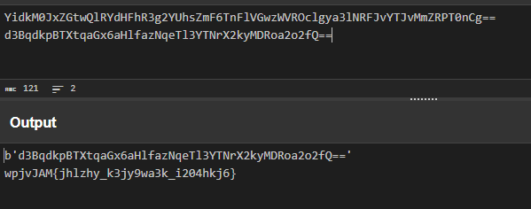

## Mod 26
Here we use the **CyberChef** website to reverse the **ROT13** encoded cipher.  
Flag:  **picoCTF{next_time_I'll_try_2_rounds_of_rot13_ulYvpVag}**  

## interencdec
The file contains what looks to be a **base64** encoded string. Once we decrypt it we get another base64 encrypted string. Decrypting it further gives us the encoded flag.  
  
Decrypting the **Ceaser cipher** with a shift of 7 we get the flag.  
Flag: **picoCTF{caesar_d3cr9pt3d_b204adc6}**  

