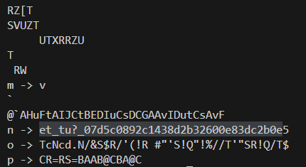

## caesar
From the challenge name we can guess that it's a ceaser cipher. Decoding it with a shift of 22 we get the key.  
Flag: **picoCTF{crossingtherubiconvfhsjkou}**  


## New Caesar
From the code we can observe that first, it's taking the flag and then based on a single letter key from **'abcdefghijklmnop'** it's doing a base64 encode. It's first converting each letter into 8 bits binary, dividing them into two groups of 4, then converting it back into a number. Its then using this number as an index and picking the corresponding letter from **ALPHABET** and then appends it to the encrypted text.  
In the second step, it similarly shifts a letter c of the encoded text by the letter k cyclically taken from the key based on the indexes.  
We already have two clues:
* The length of the key is 1 -> ***assert len(key) == 1***
* The key is one of the letters of **ALPHABET** -> ***assert all([k in ALPHABET for k in key])***
Using these two ideas we write a decryption algorithm to list all possible decrypted values of the encrypted text.  
```
import string
ALPHABET = string.ascii_lowercase[:16]  # 'abcdefghijklmnop'
LOWERCASE_OFFSET = ord("a")

def b16_decode(encoded):
    assert len(encoded) % 2 == 0
    decoded = ""
    for i in range(0, len(encoded), 2):
        first = format(ALPHABET.index(encoded[i]), '04b')
        second = format(ALPHABET.index(encoded[i + 1]), '04b')
        byte = first + second
        decoded += chr(int(byte, 2))
    return decoded

def unshift(c, k):
    t1 = ord(c) - LOWERCASE_OFFSET
    t2 = ord(k) - LOWERCASE_OFFSET
    return ALPHABET[(t1 - t2) % len(ALPHABET)]

enc = ''

for key in ALPHABET:
    decrypt = ""
    for i, c in enumerate(enc):
        decrypt += unshift(c, key[i % len(key)])
    print(key,'->',b16_decode(decrypt))
```
After that we just go through the possible decryptions and use the one that looks like the proper text.  
  
Flag: **picoCTF{et_tu?_07d5c0892c1438d2b32600e83dc2b0e5}** 

