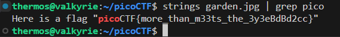

## disko  
The first thing we do with the disk image is extract it and run ***strings*** on it. For **picoCTF** we will try to search for the word *pico*. The flag is easily visible.  
  
Flag: **picoCTF{1t5_ju5t_4_5tr1n9_e3408eef}**  

## RED
For this one, ***strings*** doesn't reveal anything other than a poem. In that case there is a chance that there is more inside the image. This hints at steganography. Let's use **zsteg** to look at the image.  
  
The second part in red shows what looks like a **base64** encoded sentence repeated over and over. If we decode it we get the flag.  
  
Flag: picoCTF{r3d_1s_th3_ult1m4t3_cur3_f0r_54dn355_}  

## Secret of the Polyglot  
The file here is a pdf and when we open it we get what looks like the second half of the flag.  
  
If we examine the pdf with the **file** command we discover that it's described as a **PNG image data**. If we change the extension of the file to **png** and then open it again, we get the first half of the flag.  
  
Flag: **picoCTF{f1u3n7_1n_pn9_&_pdf_249d05c0}**  

## CanYouSee  
After unzipping the file we discover a single **.jpg** image. Once we run the image through **exiftool** we discover thaat the image has a field called ***Attribution URL*** and the value of that field is a **base64** encoded string.  
  
Once we decode it, we get the flag.   
  
Flag: **picoCTF{ME74D47A_HIDD3N_d8c381fd}**  

## Glory of the Garden  
We run **strings** on the **jpg** image and at the end of it, we get the flag.  
  
Flag: **picoCTF{more_than_m33ts_the_3y3eBdBd2cc}**  

## information
When we check the file using **exiftool**, we find that the file contains an unusual tag **License** which looks suspiciously like a **base64** string.  
  
We try to decode it, and we get the string.  
  
Flag: **picoCTF{the_m3tadata_1s_modified}**  

## Scan Surprise  
Once we log into the system we get a QR code. We just scan the qr code to get the flag.  
  
Flag: **picoCTF{p33k_@_b00_19eccd10}**  

## Verify  
Inside the home we find a **.txt**, the script and a folder.  
  
The text file contains the sha256 checksum for out target file.  
  
To find the required flag we find the sha256 checksum for all the files and then search for the particular checksum we need.  
  
We decrypt it and find the flag.  
Flag: **picoCTF{trust_but_verify_00011a60}**  

## Ph4nt0m 1ntrud3r  
Once we open the **pcap** file in wireshark, we notice that one of the packets is an **out-Of-Order** packet.  
  
Looking deeper into the file, it looks like the payload part of the packet contains a **base64** encoded string.  
  
Once we decode it we discover that it seems to be the start of the flag.  
  
Since it looks to be the start of the flag, we are gonna arrange the packets based on the timestamps and then focus on the packets that arrived chronologically after it and has a length of **12**.      
  
We can see that starting from the first illegal packet all the other packets bellow it contain a **base64** encoded string. Decoding each of them and arranging them, we get the flag.  
At the end we also check the packet with a length of **4**, since it seems like the flag is incomplete. Once we decode that the flag is complete.  
Flag: **picoCTF{1t_w4snt_th4t_34sy_tbh_4r_8e10e839}**  