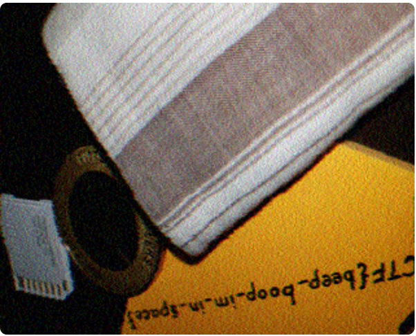
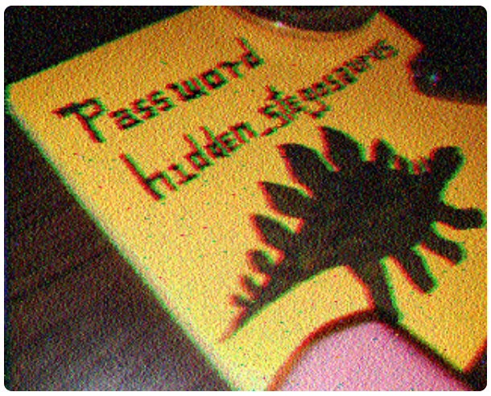
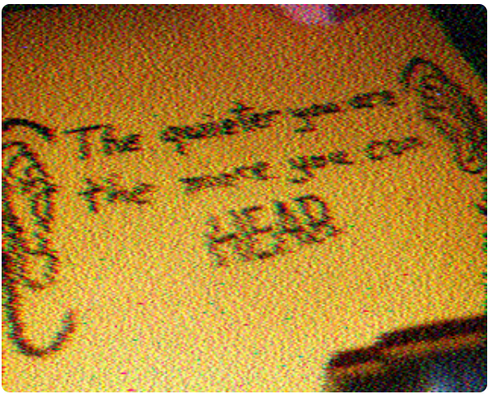
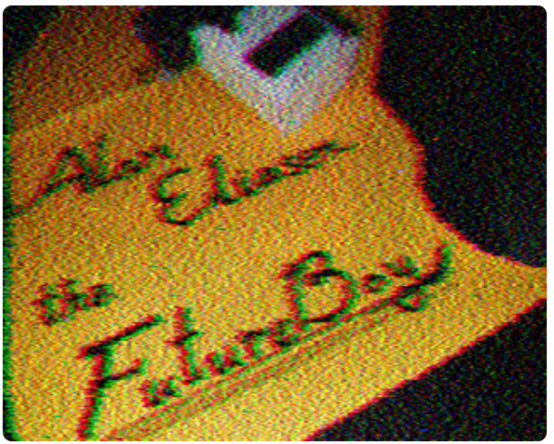
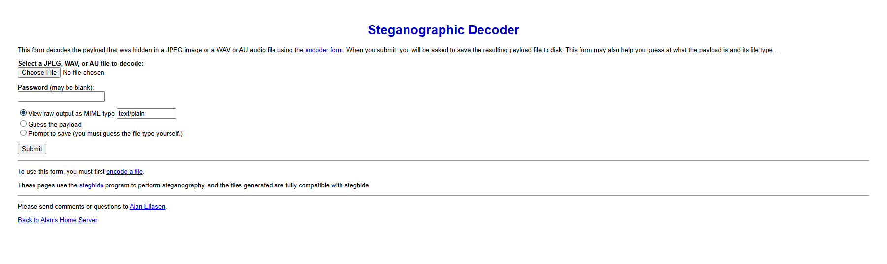

# m00nwalk2
Similar to the previous **m00walk** we use an online **SSTV** decoder and find that the image is the same as previous. 
  
On using the **SSTV** decoder on the clues we get the following images  
* Clue 1  
  
* Clue 2  
  
* Clue 3  
  
Looking up **future boy** mentioned in th third clue we reach a website to decode steganography hidden in **.wav** files.  
  
The website mentions using `steghide` and since clue 1 already mentions the password, we just put it in `steghide`.
```bash
thermos@valkyrie:~/CTFs$ steghide --extract -sf message.wav -p hidden_stegosaurus
wrote extracted data to "steganopayload12154.txt".
```
Reading the generated file, we get the password.  
```bash
thermos@valkyrie:~/CTFs$ cat steganopayload12154.txt 
picoCTF{the_answer_lies_hidden_in_plain_sight}
```
Flag: **picoCTF{the_answer_lies_hidden_in_plain_sight}**