## enhance
We open the file in an online tool **https://www.svgviewer.dev/** and then continue to zoom in until we find the flag.  
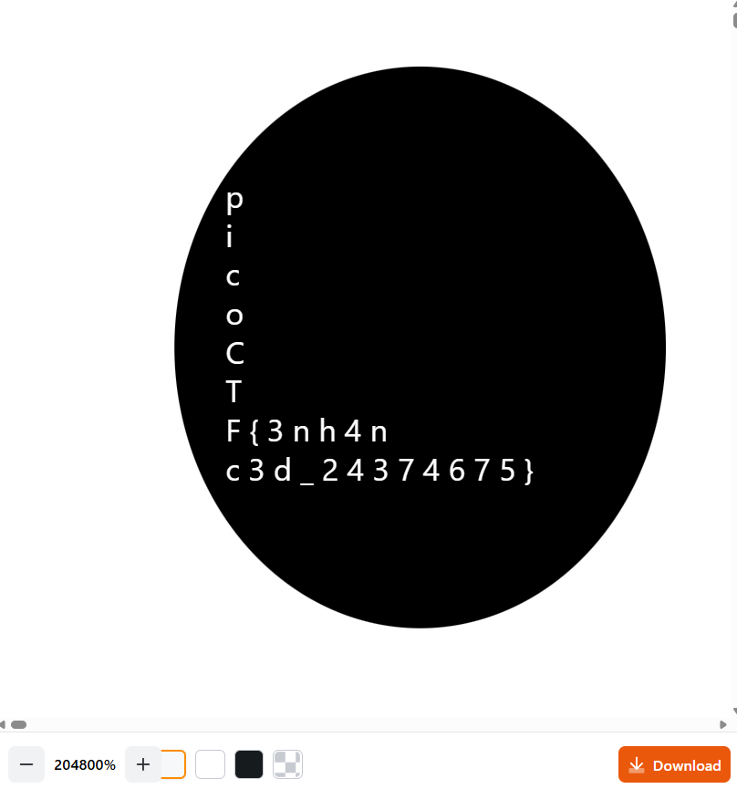  
Flag: **picoCTF{3nh4nc3d_24374675}**  

## Sleuthkit Intro
This is a simple intorduction to **sleuthkit**. After unzipping the file, we just **mmls** into it and then connect to the web instance to answer the question about the file sector length.  
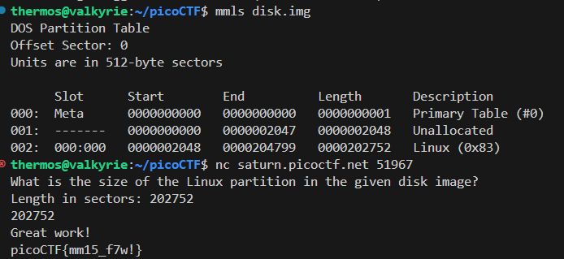  
Flag: **picoCTF{mm15_f7w!}**  

## Disk, disk, sleuth!
We use the **srch_strings** to print all readable strings from the image and then just **grep** for the flag.  
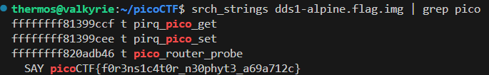  
Flag: **picoCTF{f0r3ns1c4t0r_n30phyt3_a69a712c}**  

## Disk, disk, sleuth! II  
We use the **fls** command and recursively list all the directories then **pipe** it through **grep** to find the required file. After that we just read the file via **icat**.  
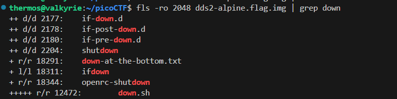  
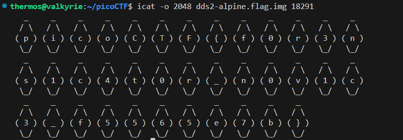  
Flag: **picoCTF{f0r3ns1c4t0r_n0v1c3_f5565e7b}**  

## Sleuthkit Apprentice
For this challenge, we search through the disk image we go through all the previous options.  
*  Search for any string **pico**
*  Search for the file named **pico**
*  Search for any **.txt** file  

The final search, gives us the flag.  
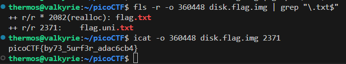  
Flag: **picoCTF{by73_5urf3r_adac6cb4}**  

## extensions
The first thing we notice is that the txt file is not a normal **.txt** file. If we use **file** command on it we discover that it is actually a **PNG image data**. We just change the extension and open it and we get the flag.  
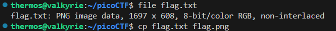  
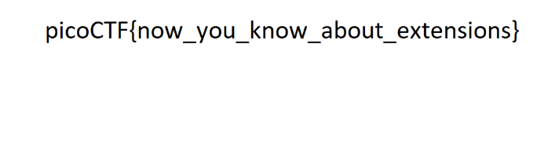  
Flag: **picoCTF{now_you_know_about_extensions}**

## St3g0
Same as a previous forensics challenge, this one has an image hidden via steganography. Since we already know the image is hidden, let's use **zsteg** to find if anything is there.  
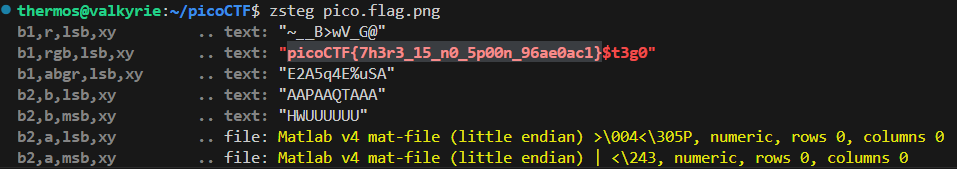  
We found the flag.  
Flag: **picoCTF{7h3r3_15_n0_5p00n_96ae0ac1}**  

## What Lies Within
Same as the previous forensics challenge, this one too has an image hidden via steganography. Since we already know the image is hidden, let's use **zsteg** to find if anything is there.  
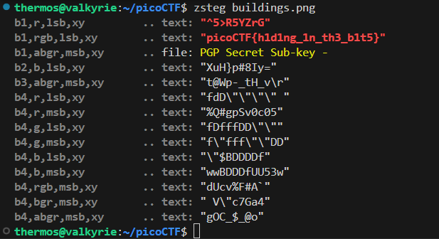  
We found the flag.  
Flag: **picoCTF{h1d1ng_1n_th3_b1t5}**   

## Packets Primer
For this challenge, all we have to do is examine the packets via wireshark. If we follow the **TCP** stream, we will get the flag.  
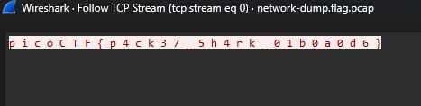  
Flag: **picoCTF{p4ck37_5h4rk_01b0a0d6}**  

## Wireshark doo dooo do doo...
We discover that there are simply too many packets to manually go through and even string searches don't give us any output. We will first apply a filter to remove packets of length 0.  
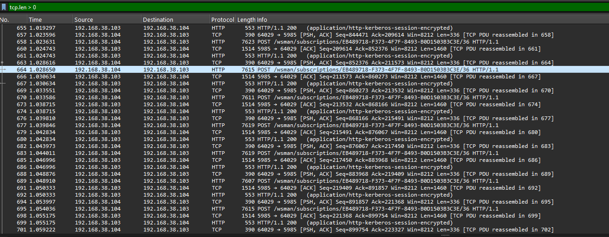  
There are still 615 packets. Then let's check the protocol hierarchy.  
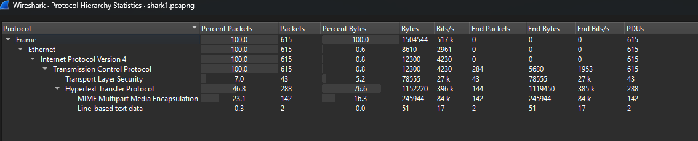  
The **Line-based text data** looks interesting. If we go through those packets, one of them contains a string that seems like an encoded flag.  
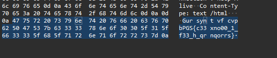  
Once we decode it, we get the flag.  
Flag: **picoCTF{p33kab00_1_s33_u_deadbeef}**  

## Trivial Flag Transfer Protocol
Inside wireshark, we see that there are many packets using the **TFTP** protocol, since the challenge itself states that files have been moved, we try to reconstruct the files. We find the list of all objects from the **udp** stream.  
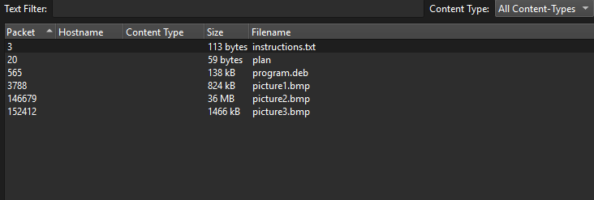  
When we check the instructions we find that it seems like an encrypted text. Once we decrypt it we find  
**TFTP DOESNT ENCRYPT OUR TRAFFIC SO WE MUST DISGUISE OUR FLAG TRANSFER.FIGURE OUT A WAY TO HIDE THE FLAG AND I WILL CHECK BACK FOR THE PLAN**  
Same for the ***plan*** file.  
**I USED THE PROGRAM AND HID IT WITH-DUEDILIGENCE. CHECK OUT THE PHOTOS**  
So, lets install the ***program.deb***  
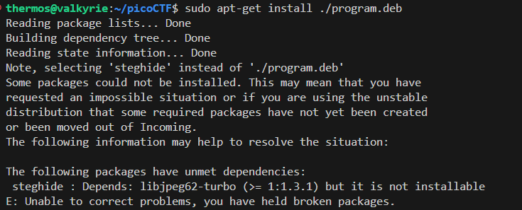  
It looks like we faced some issues, but we know that the program is trying to install **steghide**. After manually installing **steghide**, we try to extract anything possible from the images with the passwords:
* DILIGENCE
* DUE DILIGENCE
* DUEDILIGENCE  

The final password gives us a ***flag.txt*** file. This contains the flag.  
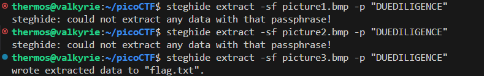  