## Obedient Cat
For this challenge, we just download the file and **cat** it to get the flag.  
Flag: **picoCTF{s4n1ty_v3r1f13d_4a2b35fd}**  


## Super SSH
For this challenge, we just need to ssh inot the given serverwith the given command.  
***ssh ctf-player@titan.picoctf.net -p57347***  
Flag: **picoCTF{s3cur3_c0nn3ct10n_45a48857}**  


## what's a net cat?
We just **netcat** into the server and get the flag.  
Flag: **picoCTF{nEtCat_Mast3ry_d0c64587}**  


## Warmed Up
**0x3D=61**  
Flag: **picoCTF{61}**  


## 2Warm
**42->101010**
Flag: **picoCTF{101010}**  


## Bases
For this, we jsut need to decode this base64 string.  
Flag: **picoCTF{l3arn_th3_r0p35}**


## Wave a flag
If we look into the downloaded file, we find that it's a **ELF executable**. We give it the necessary permissions for execution and then the program itself guides us to the flag.  
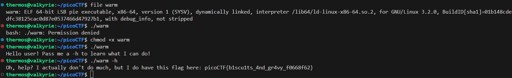  
Flag: **picoCTF{b1scu1ts_4nd_gr4vy_f0668f62}**  


## Tab, Tab, Attack
We just use the **tab-completion** to get to the execuatble after unziping it. When we run the executable, we get the flag.  
FLag: **picoCTF{l3v3l_up!_t4k3_4_r35t!_d32e018c}**  


## Insp3ct0r
We open the webpage and look at the html for the code, there we find the first third of the flag ***picoCTF{tru3_d3***.  
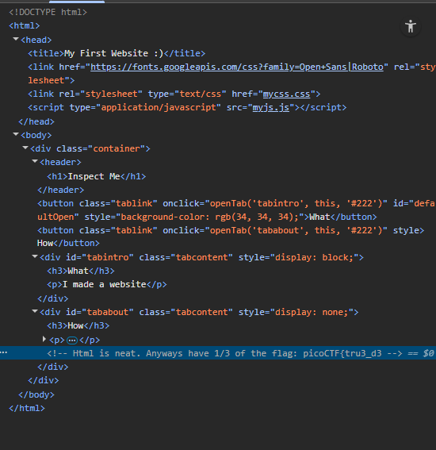  
We then go to the **sylesheet** and **js** pages linked at the top of the html to find the other parts.  
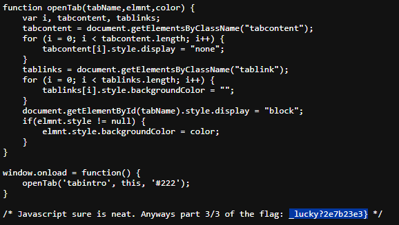  
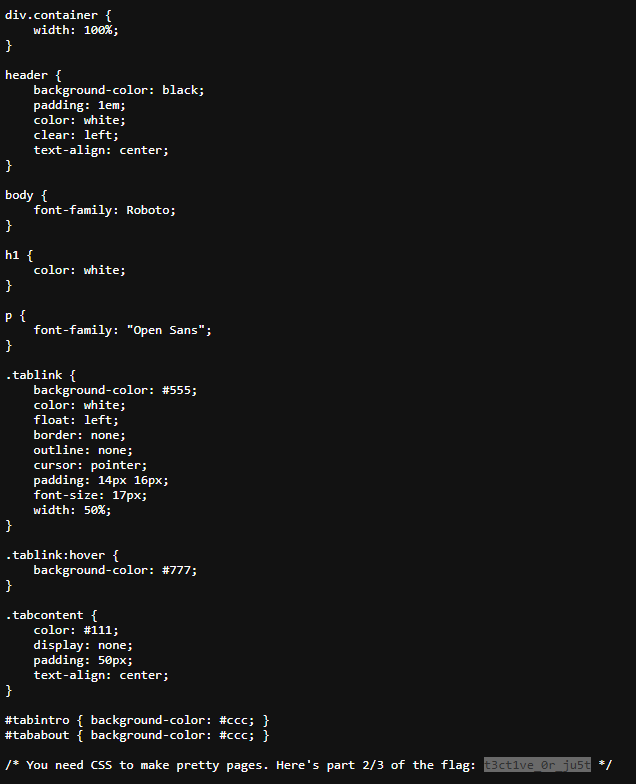  
Flag: **picoCTF{tru3_d3t3ct1ve_0r_ju5t_lucky?2e7b23e3}**  


## strings it
We use the **strings** command to search the file and then pipe it through **grep** to find the flag.  
Flag: **picoCTF{5tRIng5_1T_7f766a23}**  


## First Grep
Same as above, we use **strings** and **grep** to get the flag.  
Flag: **picoCTF{grep_is_good_to_find_things_dba08a45}**  


## where are the robots
Adding **robots.txt** at the end of the **url** gets us a list of disallowed webpages. Navigating to those webpages, gives us the flag.  
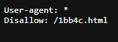  
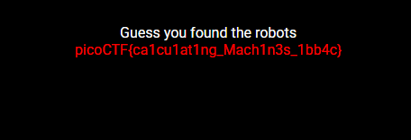  
Flag: **picoCTF{ca1cu1at1ng_Mach1n3s_1bb4c}**  


## Python Wrangling
We run the file with the given options and then enter the required password to get the flag.  
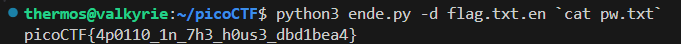  
Flag: **picoCTF{4p0110_1n_7h3_h0us3_dbd1bea4}**  


## PW Crack 1
We can just open the python file and see that there is a check for the user password.  
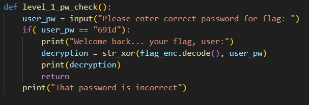  
Once we run the file and enter the password, we get the flag.  
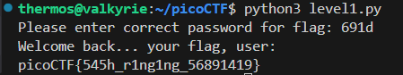  
Flag: **picoCTF{545h_r1ng1ng_56891419}**  


## PW Crack 2
Same as above, we examine the code and just convert the line ***chr(0x64) + chr(0x65) + chr(0x37) + chr(0x36)*** into normal ascii, then type it to get the flag.  
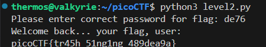  
Flag: **picoCTF{tr45h_51ng1ng_489dea9a}**  


## Big Zip
Once we unzip it we realise that it's a really big directory with many folders and files. We use **grep** to search for **pico** inside this directory.  
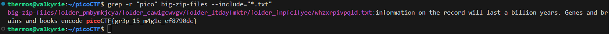  
Flag: **picoCTF{gr3p_15_m4g1c_ef8790dc}**


## Lets Warm Up
***0x70 -> p***  
Flag: **picoCTF{p}**  


## convertme.py
For this challenge, we just need to answer the question returned by the program and we get the flag.  
```
If 37 is in decimal base, what is it in binary base?
Answer: 00100101     
That is correct! Here's your flag: picoCTF{4ll_y0ur_b4535_722f6b39}
```
Flag: **picoCTF{4ll_y0ur_b4535_722f6b39}**  


## Nice netcat...
The program returns us a list of numbers, they don't look like **hex** but they might be **ascii**. Let's try to convert them from **ascii** characters to text.  
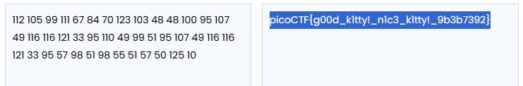  
Flag: **picoCTF{g00d_k1tty!_n1c3_k1tty!_9b3b7392}**  


## Magikarp Ground Mission
Once we ssh and run ls we see two different files, one looks like a part of the flag and the other instructions. We just follow through the instructions to get the flag.  
```
ssh ctf-player@venus.picoctf.net -p 52777
The authenticity of host '[venus.picoctf.net]:52777 ([3.131.124.143]:52777)' can't be established.
ED25519 key fingerprint is SHA256:P1f6h95BrSVnJbm2AKhphfHHGEyAeThib/rN/AwKs24.
This key is not known by any other names
Are you sure you want to continue connecting (yes/no/[fingerprint])? yes
Warning: Permanently added '[venus.picoctf.net]:52777' (ED25519) to the list of known hosts.
ctf-player@venus.picoctf.net's password: 
Welcome to Ubuntu 18.04.5 LTS (GNU/Linux 5.4.0-1103-aws x86_64)

 * Documentation:  https://help.ubuntu.com
 * Management:     https://landscape.canonical.com
 * Support:        https://ubuntu.com/advantage
This system has been minimized by removing packages and content that are
not required on a system that users do not log into.

To restore this content, you can run the 'unminimize' command.

The programs included with the Ubuntu system are free software;
the exact distribution terms for each program are described in the
individual files in /usr/share/doc/*/copyright.

Ubuntu comes with ABSOLUTELY NO WARRANTY, to the extent permitted by
applicable law.

ctf-player@pico-chall$ ls
1of3.flag.txt  instructions-to-2of3.txt
ctf-player@pico-chall$ cat 1of3.flag.txt 
picoCTF{xxsh_
ctf-player@pico-chall$ cat instructions-to-2of3.txt 
Next, go to the root of all things, more succinctly `/`
ctf-player@pico-chall$ cd /
ctf-player@pico-chall$ ls
2of3.flag.txt  bin  boot  dev  etc  home  instructions-to-3of3.txt  lib  lib64  media  mnt  opt  proc  root  run  sbin  srv  sys  tmp  usr  var
ctf-player@pico-chall$ cat 2of3.flag.txt 
0ut_0f_\/\/4t3r_
ctf-player@pico-chall$ cat instructions-to-3of3.txt 
Lastly, ctf-player, go home... more succinctly `~`
ctf-player@pico-chall$ cd ~
ctf-player@pico-chall$ ls
3of3.flag.txt  drop-in
ctf-player@pico-chall$ cat 3of3.flag.txt 
1118a9a4}
ctf-player@pico-chall$
```
Flag: **picoCTF{xxsh_0ut_0f_\/\/4t3r_1118a9a4}**  

## First Find
We unzip the file and run the **find** command with **-type f** to only look for files and **-name uber-secret.txt** for the filename to look for.  
Finally we just ***cat*** the returned the filepath to get the flag.  
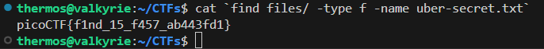  
Flag: **picoCTF{f1nd_15_f457_ab443fd1}**


## Static ain't always noise
We run **strings** on the binary file and pipe the result through **grep** for they keyword **pico**. We do this and get the flag.  
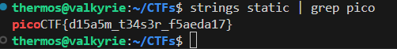  
Flag: **picoCTF{d15a5m_t34s3r_f5aeda17}**  

## fixme1.py
If we try to run the program, we quickly get an idea of the location of the error and the type of error.  
```
~/CTFs$ python3 fixme1.py 
  File "CTFs/fixme1.py", line 20
    print('That is correct! Here\'s your flag: ' + flag)
IndentationError: unexpected indent
```