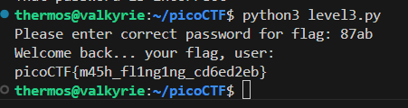
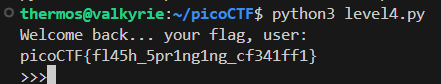

## PW Crack 3
We check the python file and find a list of passwords. We just test them one by one and find the given flag.  
  
Flag:  **picoCTF{m45h_fl1ng1ng_cd6ed2eb}**  


## PW Crack 4
We modify the program itself to loop over all the required possible passwords rather than ask for password from the user and run it to get the password.  
  
Flag: **picoCTF{fl45h_5pr1ng1ng_cf341ff1}**  


## PW Crack 5
We just modify the script to open the **dictionary.txt**, iterate over the lines and then just run the program with that as the password.  
```
import hashlib

### THIS FUNCTION WILL NOT HELP YOU FIND THE FLAG --LT ########################
def str_xor(secret, key):
    #extend key to secret length
    new_key = key
    i = 0
    while len(new_key) < len(secret):
        new_key = new_key + key[i]
        i = (i + 1) % len(key)        
    return "".join([chr(ord(secret_c) ^ ord(new_key_c)) for (secret_c,new_key_c) in zip(secret,new_key)])
###############################################################################

flag_enc = open('level5.flag.txt.enc', 'rb').read()
correct_pw_hash = open('level5.hash.bin', 'rb').read()


def hash_pw(pw_str):
    pw_bytes = bytearray()
    pw_bytes.extend(pw_str.encode())
    m = hashlib.md5()
    m.update(pw_bytes)
    return m.digest()


def level_5_pw_check(user_pw):
    # user_pw = input("Please enter correct password for flag: ")
    user_pw_hash = hash_pw(user_pw)
    
    if( user_pw_hash == correct_pw_hash ):
        print("Welcome back... your flag, user:")
        decryption = str_xor(flag_enc.decode(), user_pw)
        print(decryption)
        return


# level_5_pw_check()

with open('dictionary.txt','r') as f:
    for line in f.readlines():
        level_5_pw_check(line[:-1])
```  
Flag: **picoCTF{h45h_sl1ng1ng_fffcda23}**  


## ASCII Numbers
We just transfer the string into **cyberchef** and decode it to get the flag.  
Flag: **picoCTF{45c11_n0_qu35710n5_1ll_t311_y3_n0_l135_445d4180}**  
