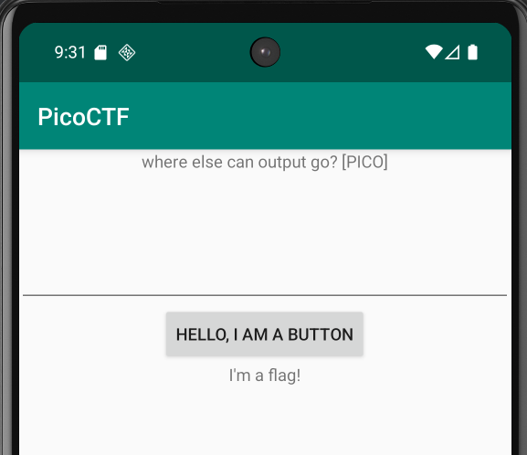
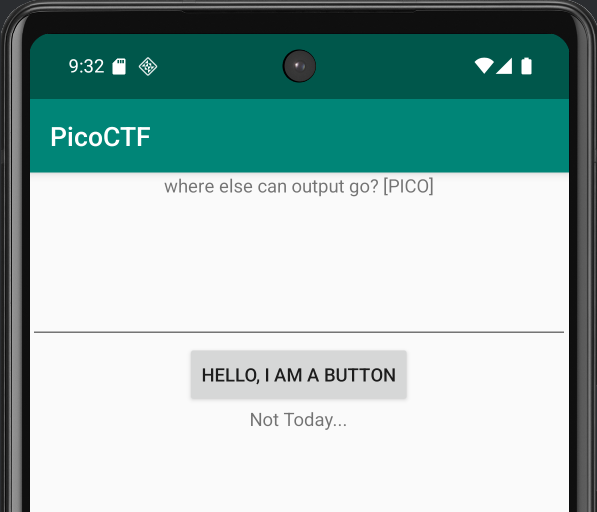

# droids0

To solve this challenge we open the **apk** file in **Android Studio**.  
We select a virtual device and then install the **apk** via `adb`. Once done we open the app in the virtual device and see the following:  
  
Since the **CTF** mentions that its about the logs, we ipen the terminal and view the logs via the command:  
`adb logcat | Select-String "PICO"`   
Then we just click on the button and the app responds  
  
Looking at the terminal output, we get the flag.
```powershell
enableLearning=false, autoCorrection=false, autoComplete=false, imeOptions=0, privateImeOptions=null, actionName=UNSPECIFIED, actionLabel=null, initialSelStart=-1, initialSelEnd=-1, initialCapsMode=0, label=null, fieldId=0,     
fieldName=null, extras=null, hintText=null, hintLocales=[]}}, false)
09-09 21:30:57.536   715  1898 W PackageConfigPersister: App-specific configuration not found for packageName: com.hellocmu.picoctf and userId: 0
09-09 21:30:57.610   715  1256 D CoreBackPreview: Window{48fe9b u0 Splash Screen com.hellocmu.picoctf EXITING}: Setting back callback null
09-09 21:30:58.036  1162  1162 D CellLayout: Adding view to ShortcutsAndWidgetsContainer: com.android.launcher3.uioverrides.PredictedAppIcon{edecab7 VFED..C.. ......ID 0,0-0,0}
09-09 21:31:02.057  2215  2239 I ellocmu.picoctf: Compiler allocated 5042KB to compile void android.view.ViewRootImpl.performTraversals()
09-09 21:32:01.371  2215  2215 I PICO    : picoCTF{a.moose.once.bit.my.sister}
```
Flag: **picoCTF{a.moose.once.bit.my.sister}**