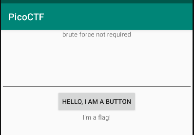
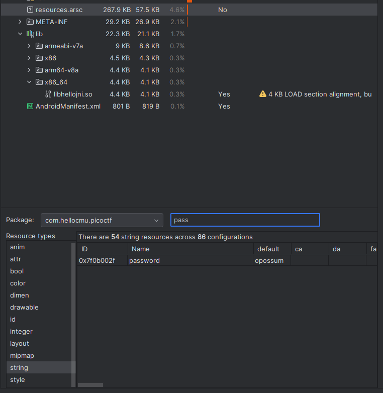
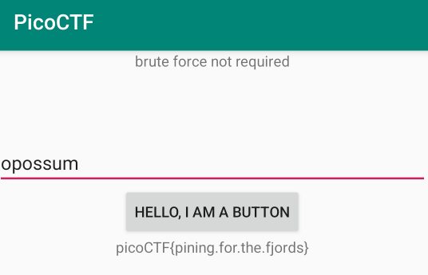

# droids1
We launch the apk in android studio.  
  
From the ctf we know that we need to find the ***pass*** to get the flag. Since it looks like the apk was built with debugging enabled, we look at the resources and we find the password in the **string** section.  
  
We enter the password in the emulator and get the flag.  
  
Flag: **picoCTF{pining.for.the.fjords}**