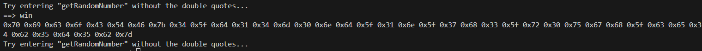

## keygenme-py
At the start of the code we notice the initial part of the flag.  
```
key_part_static1_trial = "picoCTF{1n_7h3_|<3y_of_"
key_part_dynamic1_trial = "xxxxxxxx"
key_part_static2_trial = "}"
```  
So the flag is of the form : ***picoCTF{1n_7h3_|<3y_of_xxxxxxxx}***  
In this program after we enter the license key it uses the ***check_key*** function to compare the final 8 digits of the flag with the hashes generated and then uses the flag as a key to decrypt and construct the actual version of the program.  
As long as we modify the ***check_key*** function to just pass through the checks and give us the output, we get the flag.  
```
def check_key(key, username_trial):

    global key_full_template_trial
    a = ''
    if len(key) != len(key_full_template_trial):
        return False
    else:
        # Check static base key part --v
        i = 0
        for c in key_part_static1_trial:
            if key[i] != c:
                return False

            i += 1

        # TODO : test performance on toolbox container
        # Check dynamic part --v
        if key[i] != hashlib.sha256(username_trial).hexdigest()[4]:
            # return False
            a = a + hashlib.sha256(username_trial).hexdigest()[4]
            i += 1

        if key[i] != hashlib.sha256(username_trial).hexdigest()[5]:
            # return False
            a = a + hashlib.sha256(username_trial).hexdigest()[5]
            i += 1

        if key[i] != hashlib.sha256(username_trial).hexdigest()[3]:
            # return False
            a = a + hashlib.sha256(username_trial).hexdigest()[3]
            i += 1

        if key[i] != hashlib.sha256(username_trial).hexdigest()[6]:
            # return False
            a = a + hashlib.sha256(username_trial).hexdigest()[6]
            i += 1

        if key[i] != hashlib.sha256(username_trial).hexdigest()[2]:
            # return False
            a = a + hashlib.sha256(username_trial).hexdigest()[2]
            i += 1

        if key[i] != hashlib.sha256(username_trial).hexdigest()[7]:
            # return False
            a = a + hashlib.sha256(username_trial).hexdigest()[7]
            i += 1

        if key[i] != hashlib.sha256(username_trial).hexdigest()[1]:
            # return False
            a = a + hashlib.sha256(username_trial).hexdigest()[1]
            i += 1

        if key[i] != hashlib.sha256(username_trial).hexdigest()[8]:
            # return False
            a = a + hashlib.sha256(username_trial).hexdigest()[8]
            i += 1

        print(a)

        return True
```
This modified program will crash after the last 8 digits are printed, but it will get us the last 8 digits. We just need to enter the original few characters for the flag as the license.    
  
Flag: **picoCTF{1n_7h3_|<3y_of_0d208392}**  


## Picker I
The program asks us to enter the string ***getRandomNumber*** and returns a random number. If we look at the source coe we notice that the **eval** function actually resolves which function to be called during runtime.  
```
while(True):
  try:
    print('Try entering "getRandomNumber" without the double quotes...')
    user_input = input('==> ')
    eval(user_input + '()')
  except Exception as e:
    print(e)
    break
```
And the **win** function contains the flag.
```
def win():
  # This line will not work locally unless you create your own 'flag.txt' in
  #   the same directory as this script
  flag = open('flag.txt', 'r').read()
  #flag = flag[:-1]
  flag = flag.strip()
  str_flag = ''
  for c in flag:
    str_flag += str(hex(ord(c))) + ' '
  print(str_flag)
```
So if we enter **win** we should be given the hex string of the flsg.  
  
Decoding it, we get the flag.  
Flag: **picoCTF{4_d14m0nd_1n_7h3_r0ugh_ce4b5d5b}**  


## Bit-O-Asm-1
From the assembler dump we can see that **0x30** in moved into the **eax** register.
```
<+0>:     endbr64 
<+4>:     push   rbp
<+5>:     mov    rbp,rsp
<+8>:     mov    DWORD PTR [rbp-0x4],edi
<+11>:    mov    QWORD PTR [rbp-0x10],rsi
<+15>:    mov    eax,0x30
<+20>:    pop    rbp
<+21>:    ret
```
Flag: **picoCTF{48}**  


## Bit-O-Asm-2
Similar to before, we follow the code and see that a pointer is being moved to the **eax** register. We follow the pointer to find the value stored in the pointer, ***0x9fe1a*** and get the flag.  
```
<+0>:     endbr64 
<+4>:     push   rbp
<+5>:     mov    rbp,rsp
<+8>:     mov    DWORD PTR [rbp-0x14],edi
<+11>:    mov    QWORD PTR [rbp-0x20],rsi
<+15>:    mov    DWORD PTR [rbp-0x4],0x9fe1a
<+22>:    mov    eax,DWORD PTR [rbp-0x4]
<+25>:    pop    rbp
<+26>:    ret
```
Flag: **picoCTF{654874}**  


## Bit-O-Asm-3
```
<+0>:     endbr64 
<+4>:     push   rbp
<+5>:     mov    rbp,rsp
<+8>:     mov    DWORD PTR [rbp-0x14],edi
<+11>:    mov    QWORD PTR [rbp-0x20],rsi
<+15>:    mov    DWORD PTR [rbp-0xc],0x9fe1a
<+22>:    mov    DWORD PTR [rbp-0x8],0x4
<+29>:    mov    eax,DWORD PTR [rbp-0xc]
<+32>:    imul   eax,DWORD PTR [rbp-0x8]
<+36>:    add    eax,0x1f5
<+41>:    mov    DWORD PTR [rbp-0x4],eax
<+44>:    mov    eax,DWORD PTR [rbp-0x4]
<+47>:    pop    rbp
<+48>:    ret
```
We try to back track from line **<+44>**. We see that the value of pointer **[rbp-0x4]** is stored in **eax**, which itself stores the value of **eax**. So, the value of **eax** remains unchanged. Now we focus on lines **<+15>** to **<+36>**. Tracing them we discover that  
***eax =  0x9fe1a * 0x4 + 0x1f5***  
Flag: **picoCTF{2619997}**  


## Bit-O-Asm-4
We follow  from line **<+15>**. We see that the values **0x9fe1a** and **0x2710** are being compared. Since the previous values is bigger, no jump happens and we step into line **<+31>**. Here we just subtract **0x65** and then jump to **<+41>**, where we store the value to **eax**.  
***eax = 0x9fe1a - 0x65 = 0x9FDB5***  
Flag: **picoCTF{654773}**  


## GDB baby step 1
AFter getting the program, the first thing we have to do is give it execute permissions and then open the program in **gdb** and disassemble the **main** function. For, my convenience I've set the flavor to **intel**.     
```
(gdb) disassemble main 
Dump of assembler code for function main:
   0x0000000000001129 <+0>:     endbr64 
   0x000000000000112d <+4>:     push   rbp
   0x000000000000112e <+5>:     mov    rbp,rsp
   0x0000000000001131 <+8>:     mov    DWORD PTR [rbp-0x4],edi
   0x0000000000001134 <+11>:    mov    QWORD PTR [rbp-0x10],rsi
   0x0000000000001138 <+15>:    mov    eax,0x86342
   0x000000000000113d <+20>:    pop    rbp
   0x000000000000113e <+21>:    ret    
End of assembler dump.
(gdb)
```
We can see that there is only 1 line, where we try to move the value **0x86342** into **eax** register. We can also try putting a breakpoint and then printing the register on the breakpoint.  
```
(gdb) br *main+20
Breakpoint 1 at 0x113d
(gdb) r
Starting program: /home/FraudsterCat-picoctf/debugger0_a 
warning: Error disabling address space randomization: Operation not permitted
[Thread debugging using libthread_db enabled]
Using host libthread_db library "/lib/x86_64-linux-gnu/libthread_db.so.1".

Breakpoint 1, 0x0000558ff197713d in main ()
(gdb) p/d $eax
$1 = 549698
(gdb)
```
Flag: **picoCTF{549698}**  


## GDB baby step 2
Same as above, we set a breakpoint after the eax register has been assigned and then just run the program to get the value stored in eax.  
```
(gdb) set disassembly-flavor intel 
(gdb) disassemble main
Dump of assembler code for function main:
   0x0000000000401106 <+0>:     endbr64 
   0x000000000040110a <+4>:     push   rbp
   0x000000000040110b <+5>:     mov    rbp,rsp
   0x000000000040110e <+8>:     mov    DWORD PTR [rbp-0x14],edi
   0x0000000000401111 <+11>:    mov    QWORD PTR [rbp-0x20],rsi
   0x0000000000401115 <+15>:    mov    DWORD PTR [rbp-0x4],0x1e0da
   0x000000000040111c <+22>:    mov    DWORD PTR [rbp-0xc],0x25f
   0x0000000000401123 <+29>:    mov    DWORD PTR [rbp-0x8],0x0
   0x000000000040112a <+36>:    jmp    0x401136 <main+48>
   0x000000000040112c <+38>:    mov    eax,DWORD PTR [rbp-0x8]
   0x000000000040112f <+41>:    add    DWORD PTR [rbp-0x4],eax
   0x0000000000401132 <+44>:    add    DWORD PTR [rbp-0x8],0x1
   0x0000000000401136 <+48>:    mov    eax,DWORD PTR [rbp-0x8]
   0x0000000000401139 <+51>:    cmp    eax,DWORD PTR [rbp-0xc]
   0x000000000040113c <+54>:    jl     0x40112c <main+38>
   0x000000000040113e <+56>:    mov    eax,DWORD PTR [rbp-0x4]
   0x0000000000401141 <+59>:    pop    rbp
   0x0000000000401142 <+60>:    ret    
End of assembler dump.
(gdb) br *main+59 
Breakpoint 1 at 0x401141
(gdb) r
Starting program: /home/thermos/picoCTF/debugger0_b 
[Thread debugging using libthread_db enabled]
Using host libthread_db library "/lib/x86_64-linux-gnu/libthread_db.so.1".

Breakpoint 1, 0x0000000000401141 in main ()
(gdb) i r eax
eax            0x4af4b             307019
(gdb)
```
Flag: **picoCTF{307019}**  


## GDB baby step 3 
We put a breakpoint near the edn of the function and just examine the pointer where the value is stored.  
```
(gdb) r
The program being debugged has been started already.
Start it from the beginning? (y or n) y
Starting program: /home/thermos/picoCTF/debugger0_c 
[Thread debugging using libthread_db enabled]
Using host libthread_db library "/lib/x86_64-linux-gnu/libthread_db.so.1".

Breakpoint 1, 0x000000000040111f in main ()
(gdb) x/4xb $rbp-0x4
0x7fffffffdbbc: 0x6b    0xc9    0x62    0x22
(gdb) 
```
Flag: **picoCTF{0x6bc96222}**  


## GDB baby step 4
Here after disassembling the ***main function***, we disassemble the function ***func1***.  
```
(gdb) disassemble main
Dump of assembler code for function main:
   0x000000000040111c <+0>:     endbr64 
   0x0000000000401120 <+4>:     push   rbp
   0x0000000000401121 <+5>:     mov    rbp,rsp
   0x0000000000401124 <+8>:     sub    rsp,0x20
   0x0000000000401128 <+12>:    mov    DWORD PTR [rbp-0x14],edi
   0x000000000040112b <+15>:    mov    QWORD PTR [rbp-0x20],rsi
   0x000000000040112f <+19>:    mov    DWORD PTR [rbp-0x4],0x28e
   0x0000000000401136 <+26>:    mov    DWORD PTR [rbp-0x8],0x0
   0x000000000040113d <+33>:    mov    eax,DWORD PTR [rbp-0x4]
   0x0000000000401140 <+36>:    mov    edi,eax
   0x0000000000401142 <+38>:    call   0x401106 <func1>
   0x0000000000401147 <+43>:    mov    DWORD PTR [rbp-0x8],eax
   0x000000000040114a <+46>:    mov    eax,DWORD PTR [rbp-0x4]
   0x000000000040114d <+49>:    leave  
   0x000000000040114e <+50>:    ret    
End of assembler dump.
(gdb) disassemble func1 
Dump of assembler code for function func1:
   0x0000000000401106 <+0>:     endbr64 
   0x000000000040110a <+4>:     push   rbp
   0x000000000040110b <+5>:     mov    rbp,rsp
   0x000000000040110e <+8>:     mov    DWORD PTR [rbp-0x4],edi
   0x0000000000401111 <+11>:    mov    eax,DWORD PTR [rbp-0x4]
   0x0000000000401114 <+14>:    imul   eax,eax,0x3269
   0x000000000040111a <+20>:    pop    rbp
   0x000000000040111b <+21>:    ret    
End of assembler dump.
(gdb)
```
We can see that the **eax** register is multiplied by the constant **0x3269**.  
Flag: **picoCTF{12905}**  


## ASCII FTW
We disassemble the **main** function and see that there are multiple hex values being written to the memory addresses one after starting from the location **rbp-0x30**.
```
0x0000000000001169 <+0>:     endbr64 
   0x000000000000116d <+4>:     push   rbp
   0x000000000000116e <+5>:     mov    rbp,rsp
   0x0000000000001171 <+8>:     sub    rsp,0x30
   0x0000000000001175 <+12>:    mov    rax,QWORD PTR fs:0x28
   0x000000000000117e <+21>:    mov    QWORD PTR [rbp-0x8],rax
   0x0000000000001182 <+25>:    xor    eax,eax
   0x0000000000001184 <+27>:    mov    BYTE PTR [rbp-0x30],0x70
   0x0000000000001188 <+31>:    mov    BYTE PTR [rbp-0x2f],0x69
   0x000000000000118c <+35>:    mov    BYTE PTR [rbp-0x2e],0x63
   0x0000000000001190 <+39>:    mov    BYTE PTR [rbp-0x2d],0x6f
   0x0000000000001194 <+43>:    mov    BYTE PTR [rbp-0x2c],0x43
   0x0000000000001198 <+47>:    mov    BYTE PTR [rbp-0x2b],0x54
   0x000000000000119c <+51>:    mov    BYTE PTR [rbp-0x2a],0x46
   0x00000000000011a0 <+55>:    mov    BYTE PTR [rbp-0x29],0x7b
   0x00000000000011a4 <+59>:    mov    BYTE PTR [rbp-0x28],0x41
   0x00000000000011a8 <+63>:    mov    BYTE PTR [rbp-0x27],0x53
   0x00000000000011ac <+67>:    mov    BYTE PTR [rbp-0x26],0x43
   0x00000000000011b0 <+71>:    mov    BYTE PTR [rbp-0x25],0x49
   0x00000000000011b4 <+75>:    mov    BYTE PTR [rbp-0x24],0x49
   0x00000000000011b8 <+79>:    mov    BYTE PTR [rbp-0x23],0x5f
   0x00000000000011bc <+83>:    mov    BYTE PTR [rbp-0x22],0x49
   0x00000000000011c0 <+87>:    mov    BYTE PTR [rbp-0x21],0x53
   0x00000000000011c4 <+91>:    mov    BYTE PTR [rbp-0x20],0x5f
   0x00000000000011c8 <+95>:    mov    BYTE PTR [rbp-0x1f],0x45
   0x00000000000011cc <+99>:    mov    BYTE PTR [rbp-0x1e],0x41
   0x00000000000011d0 <+103>:   mov    BYTE PTR [rbp-0x1d],0x53
   0x00000000000011d4 <+107>:   mov    BYTE PTR [rbp-0x1c],0x59
   0x00000000000011d8 <+111>:   mov    BYTE PTR [rbp-0x1b],0x5f
   0x00000000000011dc <+115>:   mov    BYTE PTR [rbp-0x1a],0x38
   0x00000000000011e0 <+119>:   mov    BYTE PTR [rbp-0x19],0x39
   0x00000000000011e4 <+123>:   mov    BYTE PTR [rbp-0x18],0x36
   0x00000000000011e8 <+127>:   mov    BYTE PTR [rbp-0x17],0x30
   0x00000000000011ec <+131>:   mov    BYTE PTR [rbp-0x16],0x46
   0x00000000000011f0 <+135>:   mov    BYTE PTR [rbp-0x15],0x30
   0x00000000000011f4 <+139>:   mov    BYTE PTR [rbp-0x14],0x41
   0x00000000000011f8 <+143>:   mov    BYTE PTR [rbp-0x13],0x46
   0x00000000000011fc <+147>:   mov    BYTE PTR [rbp-0x12],0x7d
   0x0000000000001200 <+151>:   movzx  eax,BYTE PTR [rbp-0x30]
   0x0000000000001204 <+155>:   movsx  eax,al
   0x0000000000001207 <+158>:   mov    esi,eax
   0x0000000000001209 <+160>:   lea    rdi,[rip+0xdf4]        # 0x2004
   0x0000000000001210 <+167>:   mov    eax,0x0
   0x0000000000001215 <+172>:   call   0x1070 <printf@plt>
   0x000000000000121a <+177>:   nop
   0x000000000000121b <+178>:   mov    rax,QWORD PTR [rbp-0x8]
   0x000000000000121f <+182>:   xor    rax,QWORD PTR fs:0x28
   0x0000000000001228 <+191>:   je     0x122f <main+198>
   0x000000000000122a <+193>:   call   0x1060 <__stack_chk_fail@plt>
   0x000000000000122f <+198>:   leave  
   0x0000000000001230 <+199>:   ret    
End of assembler dump.
```
If we run the program, it even gives us a little hint.
```
thermos@valkyrie:~/picoCTF$ ./asciiftw 
The flag starts with 70
```
Since it looks like the flag is being written byte by byte, we will just set up a break point after the steps and then check the memory location all at once to get the flag.  
```
Breakpoint 1, 0x0000555555555215 in main ()
(gdb) x/s $rbp-0x30
0x7fffffffdb90: "picoCTF{ASCII_IS_EASY_8960F0AF}"
(gdb)
```
Flag: **picoCTF{ASCII_IS_EASY_8960F0AF}**  


## Picker II
This program takes in the user input and then checks if there is the string ***win***, in the entered string. If not, it transforms the entered string into a function call and then executes it.  
We will just extract the necessary parameters and create a dummy test function.
```
def win():
    print("done")

user_input = input('==> ')
eval(user_input + '()')

if 'win' in user_input:
    print("failed")
else:
    print('passed')
```
Here we can see, that as long as the entered string does not have the substring ***win***, we can pass the check and since **eval** treats the string as a normal python statement, we can just call another **eval** inside it to create the necessary string.  
  
Passing it to the instance gets us a hex string which on decoding gives us the flag.  
  
Flag: **picoCTF{f1l73r5_f41l_c0d3_r3f4c70r_m1gh7_5ucc33d_b924e8e5}**  


## Picker III
Going through the program we see that we have 4 options.  
```
==> help

This program fixes vulnerabilities in its predecessor by limiting what
functions can be called to a table of predefined functions. This still puts
the user in charge, but prevents them from calling undesirable subroutines.

* Enter 'quit' to quit the program.
* Enter 'help' for this text.
* Enter 'reset' to reset the table.
* Enter '1' to execute the first function in the table.
* Enter '2' to execute the second function in the table.
* Enter '3' to execute the third function in the table.
* Enter '4' to execute the fourth function in the table.

Here's the current table:
  
1: print_table
2: read_variable
3: write_variable
4: getRandomNumber
==> 
```
The only interesting options are the options ***read_variable*** and ***write_variable***. Since we can write any variable, we can also write the variable ***func_table***.  
```
==> 2
Please enter variable name to read: func_table
print_table                     read_variable                   write_variable                  getRandomNumber                 
==> 3
Please enter variable name to write: func_table
Please enter new value of variable: 'AAAAA'
==> 1
Table corrupted. Try entering 'reset' to fix it
==>
```
In that case all we need to do is change  one of the parameters on ***func_table*** to ***win*** and then just call the ***win*** function itself. We also notice that there is a ***check_table*** function. 
```
def check_table():
  global func_table

  if( len(func_table) != FUNC_TABLE_ENTRY_SIZE * FUNC_TABLE_SIZE):
    return False

  return True
```
So as long as the total size of the ***func_table*** remains at ***FUNC_TABLE_ENTRY_SIZE * FUNC_TABLE_SIZE***, it will be counted as a legitimate table. Also, the ***get_func*** uses space as a delimiter for function name.
```
def get_func(n):
  global func_table

  # Check table for viability
  if( not check_table() ):
    print(CORRUPT_MESSAGE)
    return

  # Get function name from table
  func_name = ''
  func_name_offset = n * FUNC_TABLE_ENTRY_SIZE
  for i in range(func_name_offset, func_name_offset+FUNC_TABLE_ENTRY_SIZE):
    if( func_table[i] == ' '):
      func_name = func_table[func_name_offset:i]
      break

  if( func_name == '' ):
    func_name = func_table[func_name_offset:func_name_offset+FUNC_TABLE_ENTRY_SIZE]
  
  return func_name
```
Keeping these condition in mind, we create the payload.
```
func_table =  '\"'+'win ' + 'A'*(28 + 32*3) + '\"'
print(func_table)
```
```
thermos@valkyrie:~/picoCTF$ python3 test.py 
"win AAAAAAAAAAAAAAAAAAAAAAAAAAAAAAAAAAAAAAAAAAAAAAAAAAAAAAAAAAAAAAAAAAAAAAAAAAAAAAAAAAAAAAAAAAAAAAAAAAAAAAAAAAAAAAAAAAAAAAAAAAAA"
```
Now we just run the program and rewrite the value.
  
Once we decode the hex string, we get the flag.  
Flag: **picoCTF{7h15_15_wh47_w3_g37_w17h_u53r5_1n_ch4rg3_226dd285}**  


