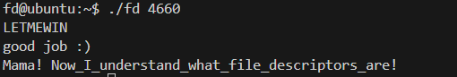
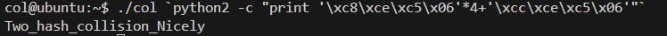

## fd  
For this level, once we log in we get to see three files inside the home folder. From the looks of it, one is the required flag and the other is a c program and it's binary. From the looks of it, the program converts the first argument of the program into a number and then subtracts it from ***0x1234***. It then reads from that particular **file descriptor** and compares it with the string ***LETMEWIN\n***. If they match then it prints the required flag.  
For linux, **file descriptors** numbered **0** represents normal input. So if we can just send set the **fd** variable to 0, we can enter the required string via the terminal. **0x1234** is equal to **4660**. So sending it should allow us to type the string directly in the terminal.  
  
Flag: **Mama! Now_I_understand_what_file_descriptors_are!**  

## col  
Once we look at the code we realise that the program takes a 20 byte string, divides itno 5 parts of 4bytes each and then adds them up.  
If the total summation equals ***0x21DD09EC***, it prints the flag. SO all we need to do is break the goal into five parts.  
***0x21DD09EC*** = 568134124 = 113626820 + 4 = 0x06C5CEC8*4 + 0x06C5CECC  
Now taking little endianess into account our string should be:  
**python -c "print '\xc8\xce\xc5\x06'*4+'\xcc\xce\xc5\x06'"**  
We use **`** to execute the command inside the parameter list itself and we get the flag.  
  
Flag: **Two_hash_collision_Nicely**  

## bof  
run in gdb, set breakpoint find point at which it breaks and then just set the new password